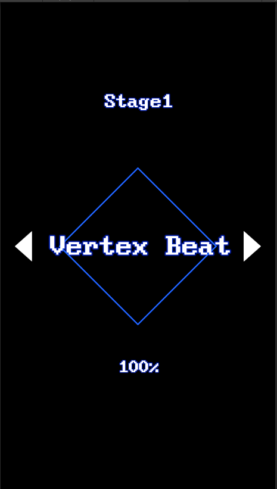

# VertexBeat

도형(Vertex)의 테두리를 따라 노트가 움직이는 리듬게임입니다. 개인 프로젝트로 진행했습니다.

- 개발 기간: 2022.05 ~ 2023.08 (간헐적 개발)
- 인원: 1인 개발
- 엔진: Unity 2021.3.26f1 (C#)

## 화면

| 로비 | 플레이 |
| :--: | :--: |
|  |  |
| 스테이지 선택 | 도형 테두리를 따라 이동하는 노트 판정 |

## 핵심 구현

**타이밍 판정 시스템 (`TimingManager.cs`)**
오디오 재생 시점(`currentPlayTime`)과 노트 목표 시점(`noteSample`)의 시간차를 계산해 Perfect / Good / Pass / Miss 4단계로 판정합니다. 판정에 성공하면 다음 노트의 목표 시점을 비트 단위(`beatPerSample`)로 갱신해, 노트가 밀리지 않고 오디오와 계속 맞물리도록 동기화합니다.

**노트·도형 시스템 (`ShapeManager.cs`, `Note.cs`, `NoteManager.cs`)**
채보(노트 순서) 데이터를 불러와, 도형 테두리를 따라 움직이는 노트(원형 커서)를 생성·이동시킵니다.

**오디오 동기화 (`AudioManager.cs`, `Sync.cs`)**
음악 재생과 노트 이동/판정의 기준 시간을 맞추는 역할을 합니다.

**그 외**
- `AnimManager.cs`: 노트 페이드 인/아웃 애니메이션
- `DataManager.cs`: 채보 데이터 로딩
- `TextManager.cs`, `ProgressBar.cs`: 점수·진행도 UI 표시
- `GameManager.cs`: 씬 전환(Lobby ↔ GamePlaying) 및 싱글턴 게임 상태 관리

## 구조

```
Assets/
├── Scenes/
│   ├── Lobby.unity        # 로비 씬 (스테이지 선택)
│   └── GamePlaying.unity  # 플레이 씬
├── Script/
│   ├── TimingManager.cs   # 판정 로직
│   ├── ShapeManager.cs    # 도형 노트 이동
│   ├── NoteManager.cs / Note.cs
│   ├── AudioManager.cs / Sync.cs
│   ├── AnimManager.cs
│   ├── DataManager.cs
│   ├── TextManager.cs / ProgressBar.cs
│   └── GameManager.cs
```

## 현재 상태

리듬게임의 핵심인 오디오-노트 동기화와 타이밍 판정 로직까지는 구현했지만, 스테이지 확장·게임오버 이후 흐름 등 완성작에 필요한 주변 기능은 구현하지 못하고 개발을 중단했습니다.

## 실행 방법

Unity 2021.3.26f1 이상에서 `VertexBeat` 폴더를 열어 `Assets/Scenes/Lobby.unity`부터 재생하면 됩니다.
